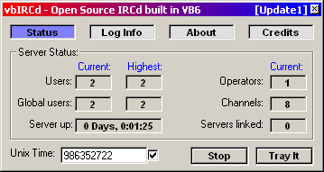



## vbIRCd \- First IRCd Submitted to PSC  \[Update2\]

### Description

Here's what allot of people have been waiting for a very long time and it's here! A fully working IRCd written in VB6! It can have about over 2,000 users connected to it at once I think on a good WinNT system and this IRCd is under the General Public License (GPL) just like all other Open Source IRCds out there. Enjoy every one! Please vote for the very hard work I've put into this project, the code it's self took 2 years to develop. *** Get Missing OCX File here: http://www.ircd-net.org/CSWSK32.zip For those who want to complain about a missing OCX file yell at PSC Admin to allow upload of OCXs again... -=- vbIRCd Support Forum at http://vbircd.ircd-net.org/forum *** Here's Update2 of vbIRCd which is v1.0.48 :D
 
### More Info
 

             |
---                |---
**Submitted On**   |2001-04-09 16:37:54
**By**             |[TRON](https://github.com/Planet-Source-Code/PSCIndex/blob/master/ByAuthor/tron.md)
**Level**          |Advanced
**User Rating**    |4.5 (45 globes from 10 users)
**Compatibility**  |VB 4\.0 \(32\-bit\), VB 5\.0, VB 6\.0
**Category**       |[Internet/ HTML](https://github.com/Planet-Source-Code/PSCIndex/blob/master/ByCategory/internet-html__1-34.md)
**World**          |[Visual Basic](https://github.com/Planet-Source-Code/PSCIndex/blob/master/ByWorld/visual-basic.md)
**Archive File**   |[vbIRCd \- F18134492001\.zip](https://github.com/Planet-Source-Code/tron-vbircd-first-ircd-submitted-to-psc-update2__1-21882/archive/master.zip)

